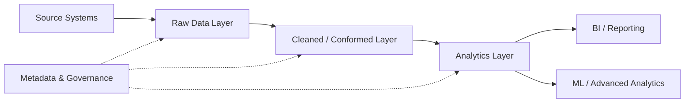
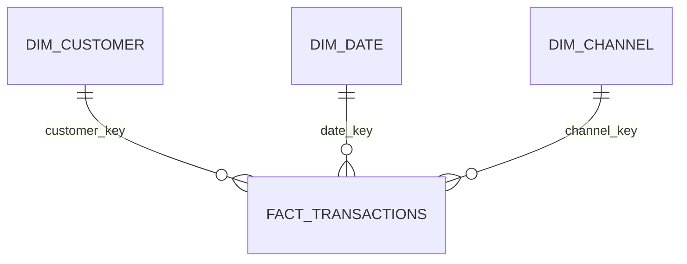

# Analytics Data Architecture Design

> A reference analytics architecture demonstrating layered data design, star schema modelling, metadata, SQL validation and governance principles.

[](https://www.sqlite.org/)
[](https://github.com/Kaviya-Mahendran/analytics-data-architecture-design)

## Why this project exists

Analytics systems often fail not because of poor dashboards, but because the underlying data architecture is fragile, inconsistent or difficult to govern.

This project presents a reference architecture for a small-to-mid-size data team. It demonstrates how to separate ingestion, transformation, modelling and consumption while maintaining clear data grain, relationships and metadata.

The goal is to demonstrate **architectural thinking**, not simply produce a dashboard.

## Architecture at a glance



## Layered data architecture

### 1. Raw layer
- Immutable ingestion of source data
- Original structure preserved
- Supports auditability and reprocessing

### 2. Cleaned / conformed layer
- Standardised formats
- Null and type handling
- De-duplication
- Consistent business keys

### 3. Analytics layer
- Business-friendly models
- Defined table grain
- Reusable dimensions
- Consistent KPI logic

## Star schema

The analytics layer uses a star schema designed for analytical querying.

**Dimensions**
- `dim_customer`
- `dim_date`
- `dim_channel`

**Fact**
- `fact_transactions`



The model is designed to make business questions easier to answer while reducing inconsistent metric definitions.

## SQL implementation

Schemas are implemented using portable SQL and can be validated locally with SQLite.

Example:

```sql
CREATE TABLE dim_customer (
    customer_key INTEGER PRIMARY KEY,
    customer_id TEXT,
    customer_segment TEXT,
    is_active INTEGER
);
```

Foreign-key relationships in the fact model support referential-integrity checks.

## Metadata & data catalog

The `metadata/` directory documents:

- table purpose
- column definitions
- ownership assumptions
- refresh expectations
- governance considerations

Metadata is treated as a first-class engineering artefact.

## Validation

From the repository root:

```bash
sqlite3 analytics.db
```

Then execute the schemas in dependency order:

```text
.read sql/dim_customer.sql
.read sql/dim_date.sql
.read sql/dim_channel.sql
.read sql/fact_transactions.sql
```

Validate the resulting tables:

```sql
SELECT name
FROM sqlite_master
WHERE type = 'table';
```

Expected tables:

```text
dim_customer
dim_date
dim_channel
fact_transactions
```

## Architecture decisions

| Decision | Rationale |
|---|---|
| Layered architecture | Separates ingestion, transformation and consumption |
| Star schema | Simplifies analytical queries and KPI consistency |
| Metadata catalogue | Improves discoverability and handover |
| SQL validation | Makes structural assumptions testable |
| Local SQLite validation | Keeps the reference design reproducible |

## Governance & privacy

This repository uses sample schemas and does not contain real customer or donor data.

A production implementation would additionally require:

- access controls
- PII classification and masking
- retention policies
- audit logging
- data ownership
- lineage
- quality monitoring

## Limitations

This is a reference architecture rather than a production data platform. It does not currently implement a cloud warehouse, orchestration framework or enterprise semantic layer.

## Roadmap

- Automated schema and data-quality tests
- Data lineage documentation
- BI semantic-layer integration
- Role-based access controls
- Incremental ingestion patterns
- Cloud warehouse implementation
- CI validation

**Focus:** SQL · data modelling · analytics architecture · governance · data quality · BI foundations